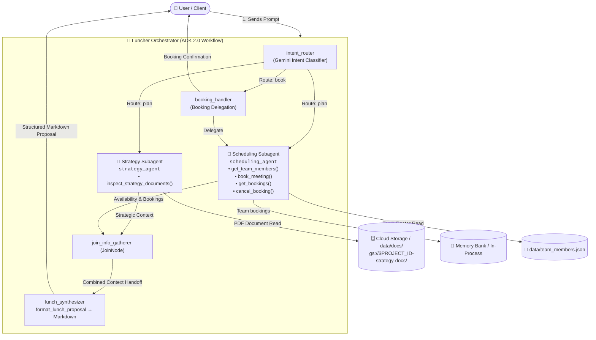

# 🍽️ Luncher: Multi-Agent Orchestration Engine

Luncher is an enterprise multi-agent application built on the **Google Agent Development Kit (ADK) v2** and **Agent-to-Agent (A2A) protocol**.

It coordinates strategy-aligned team lunch meetings by orchestrating specialized capabilities:
- 👑 **Luncher Orchestrator** (`luncher_agent`): The primary user-facing frontend agent that coordinates tasks with sub-agents and synthesizes cohesive recommendations.
  - 🎯 **Strategy Subagent** (`strategy_agent`): In-process subagent that analyzes corporate strategy documents and product launch roadmaps.
  - 📅 **Scheduling Subagent** (`scheduling_agent`): In-process subagent that evaluates team member availability, calendars, and bookings.
- 🥪 [UNIMPLEMENTED] **Catering Agent** (`cater_agent`): Remote A2A peer connecting to catering menu service to suggest food for meetings.
---

## 💻 Reading This Guide in VS Code

The architecture diagram below is a mermaid block, and the setup sections that
follow are largely copy-paste shell commands. Two extensions make both usable:

- **[Markdown Preview Mermaid Support](https://marketplace.visualstudio.com/items?itemName=bierner.markdown-mermaid)** (`bierner.markdown-mermaid`) — renders the diagrams instead of showing their source.
- **[Markdown Code Copy Button](https://marketplace.visualstudio.com/items?itemName=barnim.markdown-code-copy-button)** (`barnim.markdown-code-copy-button`) — adds a copy button to every code block.

Both are listed in `.vscode/extensions.json`, so VS Code offers them the first
time you open the repo. To install them directly:

```bash
code --install-extension bierner.markdown-mermaid
code --install-extension barnim.markdown-code-copy-button
```

Open this file in the preview pane with `Cmd+Shift+V` (`Ctrl+Shift+V` on Windows
and Linux).

---

## 🏛️ Agent Architecture Diagram

The orchestrator executes an ADK 2.0+ `Workflow` graph:
- **Intent Router**: Classifies the prompt into planning vs booking intents.
- **Planning Path (Parallel Gathering & Synthesis)**: Concurrently dispatches requests to in-process subagents `strategy_agent` and `scheduling_agent`, joins their outputs via `JoinNode`, and passes the combined context to `lunch_synthesizer` to deterministically format the structured Markdown proposal.
- **Booking Path (Direct Delegation)**: Routes selection/confirmation turns directly to `booking_handler` which delegates booking execution to `scheduling_agent`.


---

## Getting Started

### 1. 🛠️ Setup & Initialization
See: [Setup](docs/1_setup.md)

### 2. 💻 Running & Testing Agents Locally
See: [Local testing](docs/2_local.md)

### 3. ☁️ Deploying to Cloud & Agent Platform Playground
See: [Deploying to Cloud](docs/3_deploy.md)

### 4. 🥪 Extending Luncher with a catering agent
See: [Adding the catering agent](docs/4_cater_agent.md)

### 5. ✨ Registering to Gemini Enterprise
See: [Registering to Gemini Enterprise](docs/5_ge.md)

### 6. 🛡️ Enterprise Hardening (Agent Gateway, Model Armor & Agent Registry)
See: [Enterprise Hardening](docs/6_gateway_registry.md)

### 7. 🧹 Cleanup
See: [Cleanup](docs/7_cleanup.md)

---

| 🏠 Overview | [📚 Getting Started](#getting-started) | [Start: 1. Setup & Initialization ➡️](docs/1_setup.md) |
| :--- | :---: | ---: |